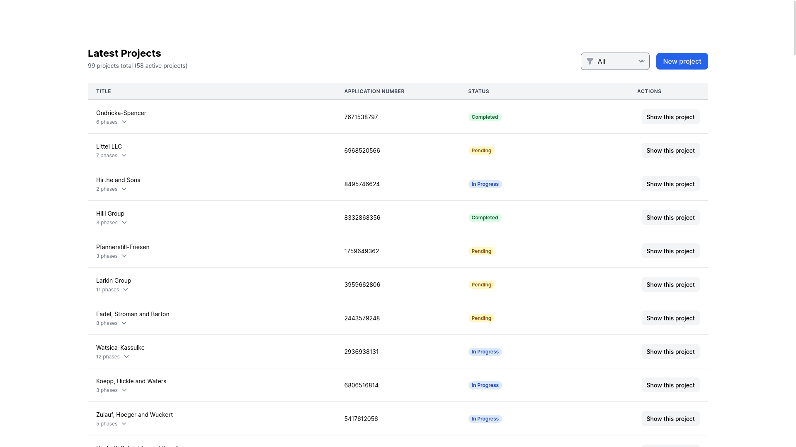
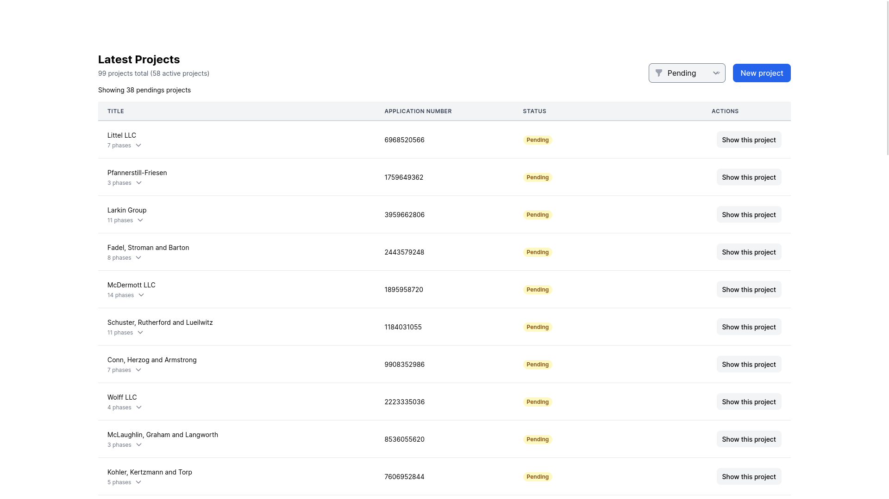

# Project Management App

## Here's what you can do with this app:

- **Add new project** - create a new project
- **Add phases to project** – create phases for project
- **Add milestones to each phases** - each phases's milestone have Internal (team-only) or Client (client-only view) milestones.
- **Edit & Delete** – Full control to edit or remove anything you need

## Demo

https://github.com/user-attachments/assets/b846f0b0-a47e-4784-8bb5-3c8cfd2cb03f

## Preview Images

1. Home page

2. Home page filter by status

3. Project's phases toggle from home page

4. Project view page

5. Project's phase view page

6. Project's phase's milestones view page

7. New project form

8. New Phase form

### Deployed on Fly.io

View live app: [click here](https://gn-project.fly.dev/projects)
